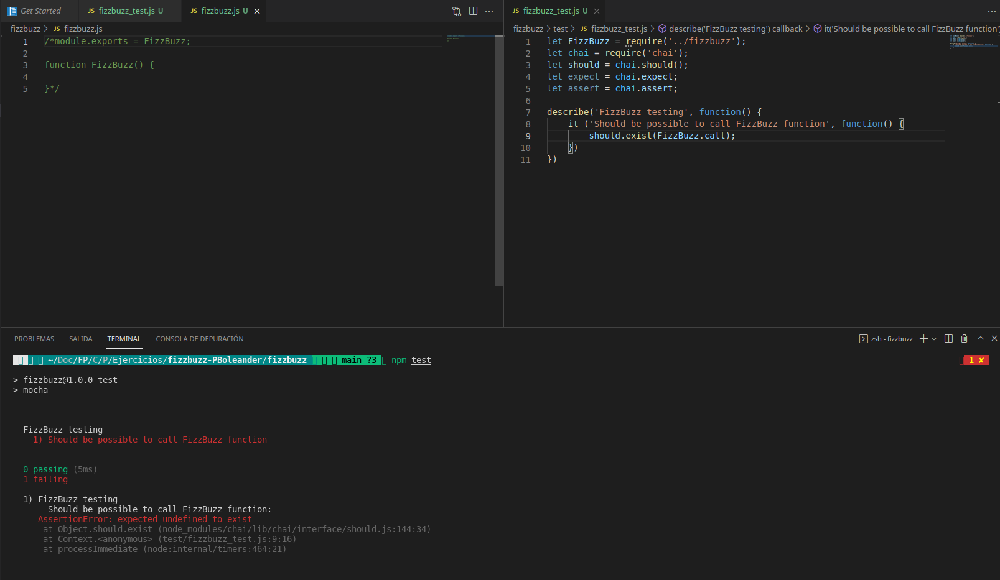
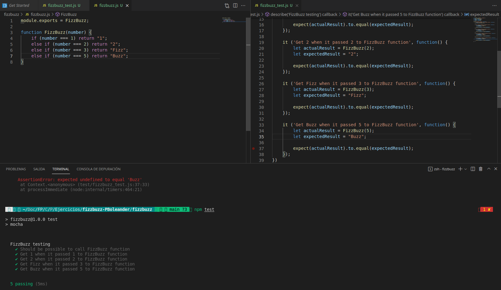

# Tarea optativa FizzBuzz con Mocha Chai

## Pascual Barrer Ferrer

### Introducción

En esta práctica vamos a implementar el método FizzBuzz en JavaScript utilizando Mocha y Chai para llevar a cabo los tests correspondientes.

Para hacerlo crearemos dos ficheros: el *fizzbuzz.js* que contendrá la lógica del programa y el *fizzbuzz_test.js*, las pruebas. Todas las capturas tomadas muestran el primer archivo en la mitad izquierda y el segundo en la derecha.

### Test del llamado a FizzBuzz

Primero comprobaremos si podemos llamar a FizzBuzz mediante un *test* que incluya el comando `should.exist(FizzBuzz.call)`. En nuestra lógica no tenemos ninguna línea válida (están comentadas), así que el *test* debe fallar como muestra la siguiente captura.

Si descomentammos o añadimos la función *FizzBuzz* con su correspondiente *exports*, la prueba debería pasar correctamente. En la siguiente imagen se puede ver que, efectivamente, eso es lo que ocurre.

### Pruebas con los distintos valores que puede devolver FizzBuzz

#### a) Valores no múltiplos de 3 ni de 5

Empezamos pasando por parámetro a la función un número que no sea divisible ni por 3 ni por 5. Según el método FizzBuzz que queremos implementar, esto debe devolver el mismo número.

Al realizar la prueba, ésta falla debido a que la función presente en nuestro *js* está vacía.

Para arreglarlo le añadimos un `return` que devuelva el valor deseado. Vemos cómo el *test* pasa en esta ocasión.

Añadimos ahora un nuevo *test*: el que prueba el valor 2. Esto debería devolvernos el mismo valor puesto ya que tampoco es divisible ni por 3 ni por 5. En esta ocasión, el último *test* falla debido a que nuestra función siempre devuelve un 1.

Si añadimos un nuevo caso al *if* podemos solventar esta situación aunque, como veremos más adelante, éste no es el mejor modo de conseguirlo. El *test* pasa con éxito y nos quedamos satisfechos (de momento).

#### b) Valores múltiplos de 3

FizzBuzz debe devolver la cadena *Fizz* cuando recibe un número múltiplo de 3. Pero no lo haremos para cualquier múltiplo de 3 sino sólo para el valor de 3. Añadimos el código nuestro archivo de pruebas y ejecutamos. Falla como era de esperar.

Añadimos la línea correspondiente a nuestra lógica para que el *test* que acabamos de hacer pase. Como veremos esto no es muy buen método y, mucho menos, si pensamos que haciéndolo así llegaríamos a tener un código kilométrico si quisiéramos implementar todos los casos. Pero ahora sólo estamos arreglando caso por caso.

El *test* pasa como pretendíamos.

#### c) Valores múltiplos de 5

Para este tipo de valores FizzBuzz debe devolver la cadena *Buzz*. Implementamos esta prueba como hemos hecho con las anteriores. Realizamos el *test* y, efectivamente, falla. Toca cambiar la lógica del programa.

Como hemos hecho previamente, añadimos un nuevo caso a nuestro `if` particular. Llegados a este punto y viendo que nuestro `if` empieza a tener tantos casos sería mejor sustituirlo por un `switch-case` pero, como que luego lo cambiaremos, no se hará.

El *test* vuelve a pasar correctamente. De momento, todos los *tests* pasan.

#### d) Valores múltiplos de 3 y 5

Para este tipo de valores FizzBuzz tiene otra salida: la cadena *FizzBuzz*. Nuevamente, realizamos el mismo proceso que hemos aplicado las veces anteriores. El *test* falla.

Añadimos el nuevo caso a nuestro `if` ya demasiado largo. El *test* vuelve a pasar.

#### e) Últimos *tests* para asegurar

Pondremos dos pruebas más para asegurar que todo está bien:

- la del FizzBuzz de 4 que debería devolver la cadena 4 y
- la del FizzBuzz de 30 que debería devolver la cadena *FizzBuzz*.

Lo ejecutamos y nos devuelve que ambos fallan como vemos en la siguiente captura.

Nuestra lógica no es la adecuada. Una posibilidad sería implementar los nuevos casos probados pero eso ya hemos visto que no es buena idea. Lo mejor será reescribir la función para que haga las cosas bien.

Además de implementar el comportamiento de FizzBuzz que ya conocemos, controlaremos que el parámetro pasado a la función sea, efectivamente, del tipo correcto: un número.

Realizamos las pruebas de nuevo y todas pasan correctamente. Nuestra implementación ahora es correcta y mucho más sencilla que la anterior.

